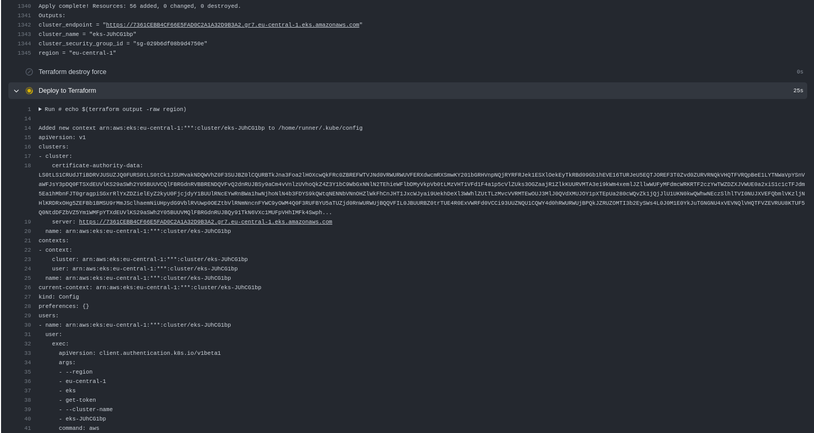
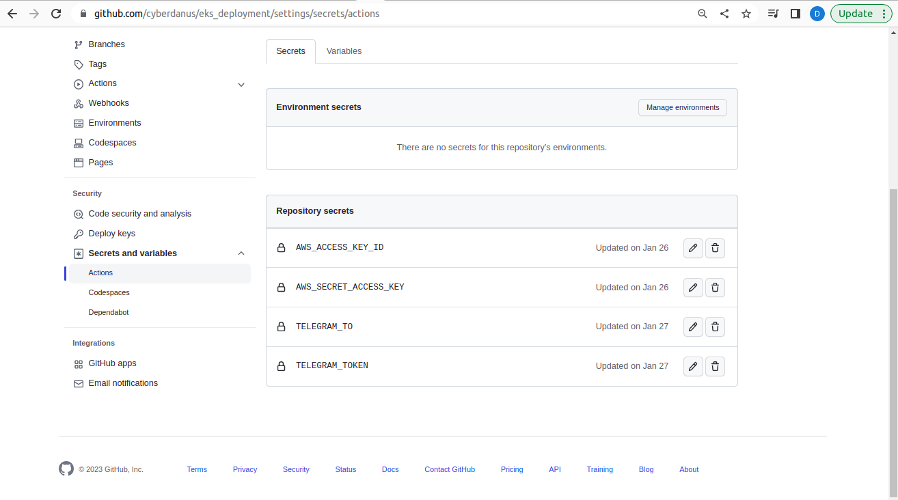
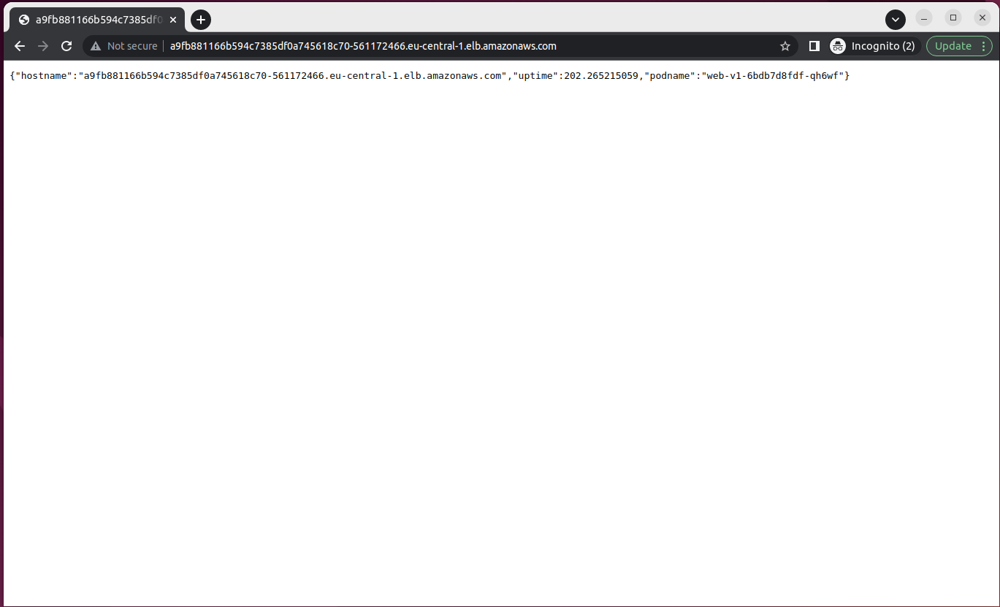
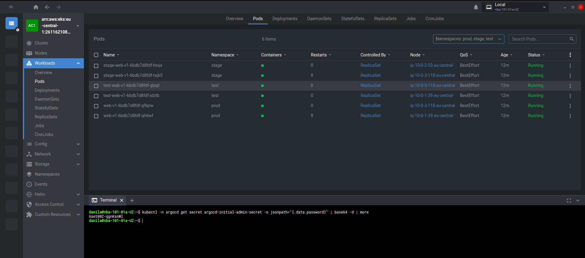
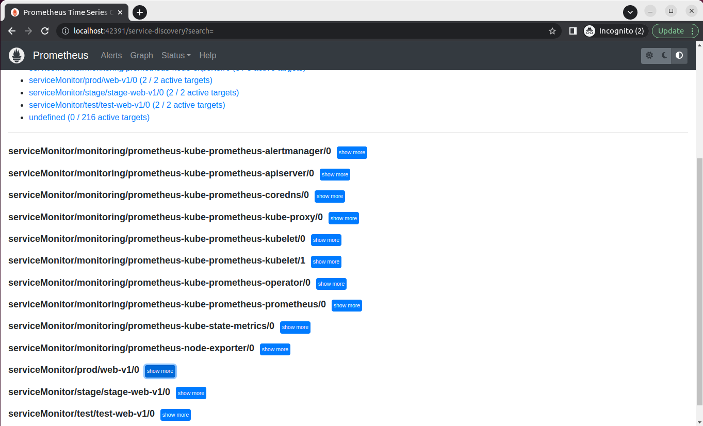
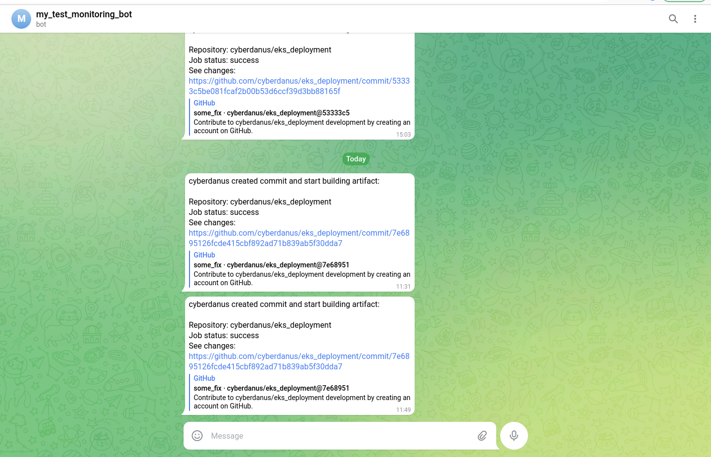

## Urban Task

This repo contains a [Terraform](https://www.terraform.io) code for running a Kubernetes cluster on [Amazon Web Services (AWS)](https://aws.amazon.com/) using [Amazon Elastic Kubernetes Service (EKS)](https://aws.amazon.com/eks/) and GitHub Action to Build, Publish, and Deploy an application. You can see the application metrics in Prometheus.

## Table of contents

---

- [Urban Task](#urban-task)
- [Table of contents](#table-of-contents)
- [Quickstart](#quickstart)
  - [Building Infrastructure in AWS](#building-infrastructure-in-aws)
    - [Building Infrastructure by pipeline](#building-infrastructure-by-pipeline)
    - [Building Infrastructure step by step](#building-infrastructure-step-by-step)
  - [Terraform code](#terraform-code)
  - [How use GitHub Actions to deploy application](#how-use-github-actions-to-deploy-application)
    - [Add GitHub Repository Secrets](#add-github-repository-secrets)
    - [Deploy App](#deploy-app)
    - [Workflow Steps](#workflow-steps)
    - [Docker image name](#docker-image-name)
  - [**Deploy configuration**](#deploy-configuration)
  - [Changes in the application](#changes-in-the-application)
- [Destroy infrustructure](#destroy-infrustructure)
- [Homework task for Urban](#homework-task-for-urban)
  - [Requirements](#requirements)
  - [What gets evaluated](#what-gets-evaluated)
- [List of decisions/compromises](#list-of-decisionscompromises)

---

## Quickstart

Please review the `Requirements` before starting.

<details><summary>Requirements</summary>

**Requirements**

* Terraform and kubectl are [installed](#software-dependencies) on the machine where Terraform manifests is executed.
* The Compute Engine and Kubernetes Engine APIs are [active](#enable-apis) on the project you will launch the cluster in.

**Amazon Cloud Account**
- You have to loginin your Amazon Cloud Account
- [Add billing on this Project](https://aws.amazon.com/premiumsupport/knowledge-center/tags-billing-cost-center-project/)

**Software Dependencies**
- [kubectl](https://github.com/kubernetes/kubernetes/releases) >= 1.26.x

**Terraform and Plugins**
- [Terraform](https://www.terraform.io/downloads.html)    >= 1.3.x
- [Terraform Provider for AWS] [terraform-provider-aws](https://registry.terraform.io/providers/hashicorp/aws/latest) >= 4.55.x

</details></br>

### Building Infrastructure in AWS

AWS Cloud Account
  * You have to login in your [AWS Cloud Account](https://console.aws.amazon.com/console/home?nc2=h_ct&src=header-signin)
  * [Add billing on this Project](https://aws.amazon.com/premiumsupport/knowledge-center/tags-billing-cost-center-project)

#### Building Infrastructure by pipeline

We can use the script `start.sh` from backend dir to create AWS S3 Terraform remote state backend for Infrustructure.  
You have to run the script from folder [backend](/backend/).  

  * Before start you have to connect to AWS cloud CLI in terminal:
    * `aws configure` - connect to your AWS Account with existing credentials
  * Clone repository
    * `git clone https://github.com/cyberdanus/eks_deployment.git`
  * Add GitHub Secrets to Action in your Repository
    * The necessary secrets are AWS_ACCESS_KEY_ID, AWS_SECRET_ACCESS_KEY. Also we can use TELEGRAM_TO and TELEGRAM_TOKEN secrets for ChatOPS
    * You have to [add this secrets](#how-use-github-actions-to-deploy-application) in your GitHub Repository

</br>

#### Building Infrastructure step by step

The second way is to build infrastructure step by step. (*Tested on Ubuntu 22*)

<details><summary>Use AWS Cloud CLI</summary>

* Go to [AWS Cloud Console](https://console.aws.amazon.com/console/home?nc2=h_ct&src=header-signin) and autorize.
* [Install the AWS cloud CLI](https://docs.aws.amazon.com/cli/latest/userguide/getting-started-install.html)
* [Install the Terraform CLI](https://developer.hashicorp.com/terraform/tutorials/aws-get-started/install-cli)


```bash
# install AWS cloud CLI for Ubuntu
curl "https://awscli.amazonaws.com/awscli-exe-linux-x86_64.zip" -o "awscliv2.zip"
unzip awscliv2.zip
sudo ./aws/install

# install Terraform CLI for Ubuntu
sudo apt-get update && sudo apt-get install -y gnupg software-properties-common

# Connect to AWS CLI with existing credentials
aws configure
```

# Clone GitHub repository
```bash  
git clone https://github.com/cyberdanus/eks_deployment.git
```
# Create Remote tfstate S3 Bucket to save tfstate-files
You have to run the terraform cli from folder [backend](/backend/).  
```bash
# Go to folder `backend` and run commands:
terraform init
terraform apply -auto-approve


```
# Create infrastructure with Terraform
You have to run the terraform cli from folder [eks_dep](/eks_dep/).  
```bash
# Go to folder `eks_dep` and run commands:
terraform init
terraform apply -auto-approve


```
</details>

<details><summary>Connect to EKS Cluster</summary>

Then you have to Connect to EKS Cluster

```bash
# Update the kubectl configuration:
aws eks --region $(terraform output -raw region) update-kubeconfig --name $(terraform output -raw cluster_name)

# test connetion
kubectl get nodes
```

</details>


### Terraform code

<details><summary>Infrustructure</summary>
Any manifests are based at [eks_dep](/eks_dep/) directory.


* **eks-cluster.tf** - EKS Kubernetes (K8s) CLuster
* **main.tf** - TF requerments: backend, requiered providers and providers, Datasources
* **vpc.tf** - VPC, Subnet, Router, NAT, Firewall
* **outputs.tf** - Output data
* **variables.tf** - Used variables


</details>

### How use GitHub Actions to deploy application

When infrustructure ready you can use [GitHub Actions](https://github.com/cyberdanus/eks_deployment/blob/main/.github/workflows/main.yml) with workflow dispatch to deploy and destroy Kubernetes Cluster with ArgoCD wich inplements GitOPS strategy of application deployment.

</br>

#### Add GitHub Repository Secrets

GitHub Secrets link like this: `https://github.com/<Your-Account-Name>/<Your-Repository>/settings/secrets/actions`

  * **AWS_ACCESS_KEY_ID** - Service Access Key to connect in Cluster
  * **AWS_SECRET_ACCESS_KEY** - Secret Access Key to connect in Cluster
  * **TELEGRAM_TO** - Telegram channel id for sending a messages
  * **TELEGRAM_TOKEN** - Telegram API access token
  * **SLACK_WEBHOOK**` - [Webhook URL](https://api.slack.com/apps/*******/incoming-webhooks?) to connect in [Slack API](https://api.slack.com) and send messages
  * **SLACK_BOT_TOKEN** - Slack channel id token for sending a messages
  * **DOCKERHUB_TOKEN** - Docker token for access to DockerHub
  * **DOCKERHUB_USERNAME** - DockerHub Username

<details><summary>Screenshots and Commands to get GitHub Repository Secrtets</summary>

</br>

* You can Get Secrets by  command.
```bash
terraform output
```

* Example of output:



* GitHub Secrets link like this: `https://github.com/<Your-Account-Name>/<Your-Repository>/settings/secrets/actions`
* Screenshot from GitHub Repository Secrets page



</details></br>


#### Deploy App

<details><summary>Deploy App</summary>

You have to go in [GitHub Actions page](https://github.com/cyberdanus/eks_deployment/blob/main/.github/workflows/main.yml) and run `Install` like on picture bellow.


</br>

#### Workflow Steps
* **Checkout** - Clone GitHub repository
* **Setup Terraform** - Setup terraform CLI utility
* **Setup KubeCTL** - Setup kubectl CLI utility  
* **Install AWS CLI** - Setup aws CLI utility 
* **Configure AWS Credentials** - Configure the AWS credentials so we can deploy to the cluster
* **Terraform Fmt** - Rewrite Terraform configuration files to a canonical format and style
* **Terraform Init** - Terraform's command for initialize the working directory.
* **Terraform Validate** - Validate Terraform configuration files in a directory.  
* **Terraform Plan** -  Creates Terraform execution plan, for preview the changes that plans to make to your infrastructure
* **Terraform Apply Force** - Force execute for apply the actions proposed in a Terraform plan.
* **Terraform Destroy Force** - Force execute for destroy the actions proposed in a Terraform plan.
* **Deploy to Terraform** - Deploy pre init applications to EKS Cluster.
* **Deploy to ArgoCD** - Deploy in Cluster any stages of application.
* **Send Telegram message on push** - ChatOPS implementation.

</br>

#### Docker image name
Docker image has image name: 
* `https://hub.docker.com/r/cyberdanus/my_app:latest`

</details></br>

### **Deploy configuration**

Deploy use ArgoCD for continuous deployment, all configuration files you can find in folder [argo_cd](/argo_cd/)

* `ingress-nginx.yaml` - Deploy NGINX ingress controller from HELM chart
* `prom.yaml` - Deploy Kube-Prometheus Operator from HELM chart
* `prodenv.yaml` - Deploy a Production environment of the application
* `testenv.yaml` - Deploy a Test environment of the application
* `stageenv.yaml` - Deploy a Stage environment of the application


</br><details><summary>Deploy results</summary>








</details></br>

<details><summary>Show the application the Internet</summary>

In this task i use dynamic name witch assigned to ingress comtroller. In future if domain was enable to assign we able to use Route53 for dynamic name assigning to the project.




</details></br>


## Destroy infrustructure

You have to go in [GitHub Actions page](https://github.com/cyberdanus/eks_deployment/blob/main/.github/workflows/main.yml) and run `Destroy` like on picture bellow.
(*it takes about 15-20 minutes*)


---

## Homework task for Urban

* [Application and Task](documentation/hw)

The goal of the task is to demonstrate how a candidate can create an environment with terraform. You should commit little and often to show your ways of working

### Requirements

- The environment should get created in Google Cloud Platform
- Create a VPC native Kubernetes cluster
- Host the provided Node.js application provided in the `app` folder in the created cluster with 3 replicas
- Expose the provided application to the public internet
- Include at least 1 custom module in Terraform
- Add the prometheus-client to the provided application and expose one metric on a `/metrics` endpoint
- Write down some thoughts about what compromises you've applied (if any) and how would you like to improve the solution

### What gets evaluated

- Code quality
- Solution architecture
- Whether the code is "production-ready" (i.e. the environment starts and works as expected)


---


